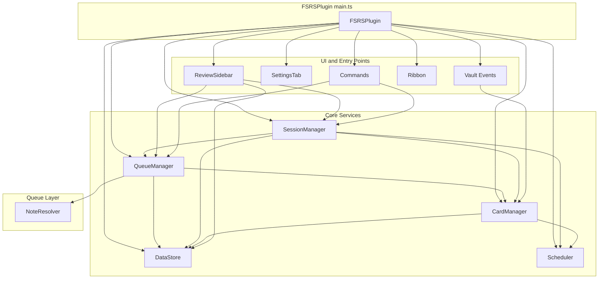

# High-Level Architecture

Plugin entry point, core services, and dependencies.

```mermaid
flowchart TB
    subgraph plugin [FSRSPlugin main.ts]
        FSRSPlugin[FSRSPlugin]
    end

    subgraph core [Core Services]
        DataStore[DataStore]
        Scheduler[Scheduler]
        CardManager[CardManager]
        QueueManager[QueueManager]
        SessionManager[SessionManager]
    end

    subgraph queues [Queue Layer]
        NoteResolver[NoteResolver]
    end

    subgraph ui [UI and Entry Points]
        ReviewSidebar[ReviewSidebar]
        SettingsTab[SettingsTab]
        Commands[Commands]
        Ribbon[Ribbon]
        VaultEvents[Vault Events]
    end

    FSRSPlugin --> DataStore
    FSRSPlugin --> Scheduler
    FSRSPlugin --> CardManager
    FSRSPlugin --> QueueManager
    FSRSPlugin --> SessionManager
    FSRSPlugin --> ReviewSidebar
    FSRSPlugin --> SettingsTab
    FSRSPlugin --> Commands
    FSRSPlugin --> Ribbon
    FSRSPlugin --> VaultEvents

    QueueManager --> NoteResolver
    QueueManager --> CardManager
    QueueManager --> DataStore

    SessionManager --> QueueManager
    SessionManager --> CardManager
    SessionManager --> Scheduler
    SessionManager --> DataStore

    CardManager --> DataStore
    CardManager --> Scheduler

    ReviewSidebar --> SessionManager
    ReviewSidebar --> QueueManager
    ReviewSidebar --> DataStore

    Commands --> SessionManager
    Commands --> QueueManager

    VaultEvents --> CardManager
```
