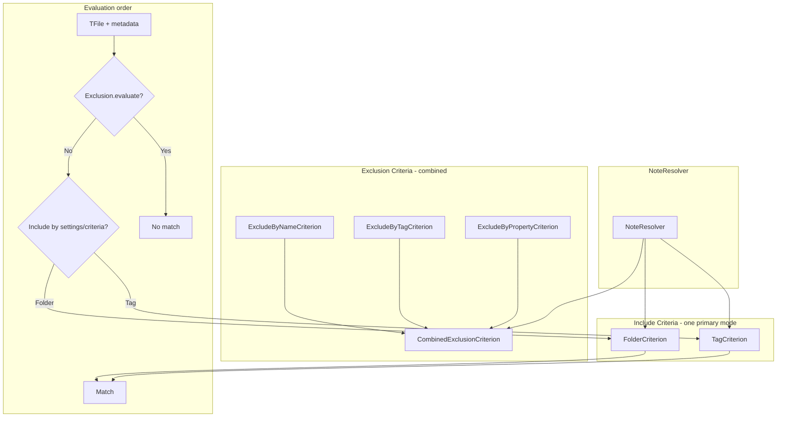

# Criteria System

Note selection and extensibility (PRD F1.3, src/criteria).

Future: SelectionCriterion interface — `id`, type include/exclude, `evaluate(file, metadata)` — for regex, link count, etc.
