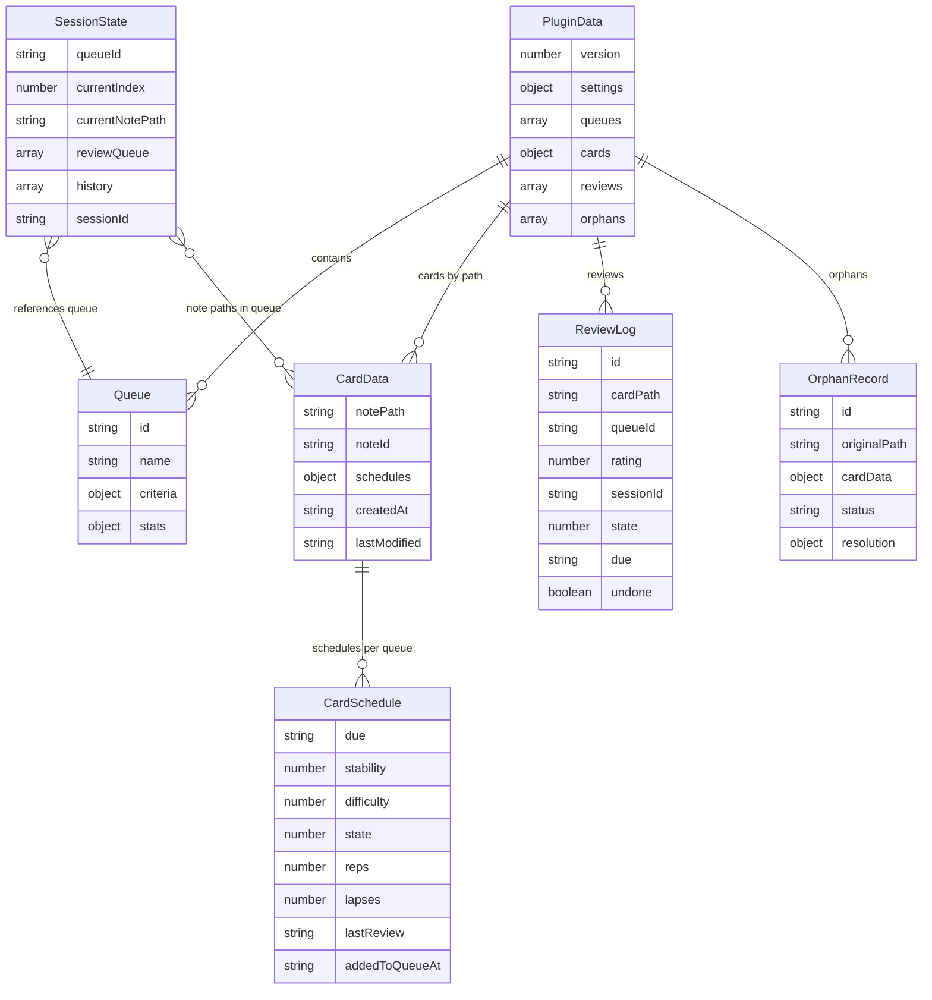

# Data Model / Entity Relationship

Persisted and in-memory structures from PluginData and types.

```mermaid
erDiagram
    PluginData ||--o{ Queue : "contains"
    PluginData ||--o{ CardData : "cards by path"
    PluginData ||--o{ ReviewLog : "reviews"
    PluginData ||--o{ OrphanRecord : "orphans"
    CardData ||--o{ CardSchedule : "schedules per queue"

    PluginData {
        number version
        object settings
        array queues
        object cards
        array reviews
        array orphans
    }

    Queue {
        string id
        string name
        object criteria
        object stats
    }

    CardData {
        string notePath
        string noteId
        object schedules
        string createdAt
        string lastModified
    }

    CardSchedule {
        string due
        number stability
        number difficulty
        number state
        number reps
        number lapses
        string lastReview
        string addedToQueueAt
    }

    ReviewLog {
        string id
        string cardPath
        string queueId
        number rating
        string sessionId
        number state
        string due
        boolean undone
    }

    SessionState {
        string queueId
        number currentIndex
        string currentNotePath
        array reviewQueue
        array history
        string sessionId
    }

    OrphanRecord {
        string id
        string originalPath
        object cardData
        string status
        object resolution
    }

    SessionState }o--|| Queue : "references queue"
    SessionState }o--o{ CardData : "note paths in queue"
```
