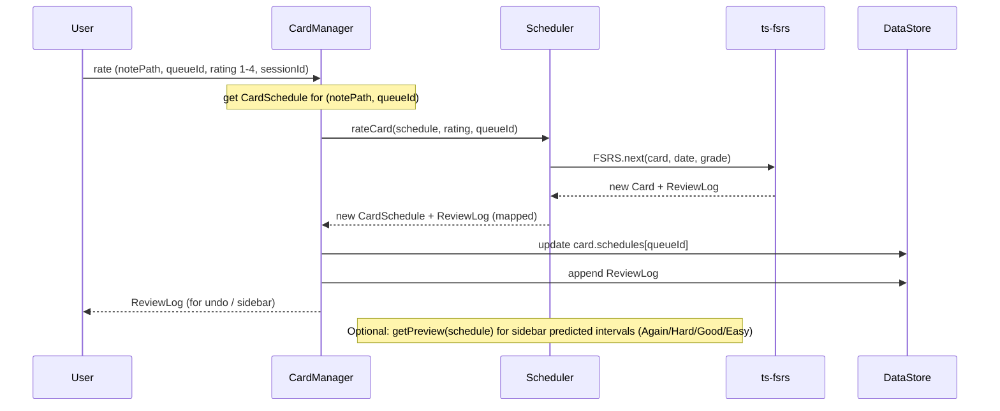

# FSRS Rating Flow (Single rating)

What happens when the user rates one note; bridge between plugin and ts-fsrs.

```mermaid
sequenceDiagram
    participant User
    participant CardManager as CardManager
    participant Scheduler as Scheduler
    participant tsFsrs as ts-fsrs
    participant DataStore as DataStore

    User->>CardManager: rate (notePath, queueId, rating 1-4, sessionId)
    Note over CardManager: get CardSchedule for (notePath, queueId)
    CardManager->>Scheduler: rateCard(schedule, rating, queueId)
    Scheduler->>tsFsrs: FSRS.next(card, date, grade)
    tsFsrs-->>Scheduler: new Card + ReviewLog
    Scheduler-->>CardManager: new CardSchedule + ReviewLog (mapped)
    CardManager->>DataStore: update card.schedules[queueId]
    CardManager->>DataStore: append ReviewLog
    CardManager-->>User: ReviewLog (for undo / sidebar)

    Note over Scheduler: Optional: getPreview(schedule) for sidebar predicted intervals (Again/Hard/Good/Easy)
```
