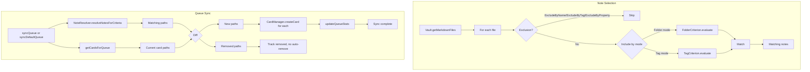

# Note Selection and Queue Sync

How notes are selected (criteria) and the default queue is synced.

```mermaid
flowchart TB
    subgraph selection [Note Selection]
        Vault[Vault.getMarkdownFiles]
        Vault --> ForEach[For each file]
        ForEach --> Exclusions{Exclusion?}
        Exclusions -->|ExcludeByName/ExcludeByTag/ExcludeByProperty| Skip[Skip]
        Exclusions -->|No| Include{Include by mode}
        Include -->|Folder mode| FolderCriterion[FolderCriterion.evaluate]
        Include -->|Tag mode| TagCriterion[TagCriterion.evaluate]
        FolderCriterion --> Match[Match]
        TagCriterion --> Match
        Match --> MatchingNotes[Matching notes]
    end

    subgraph sync [Queue Sync]
        SyncStart[syncQueue or syncDefaultQueue]
        SyncStart --> Resolve[NoteResolver.resolveNotesForCriteria]
        Resolve --> MatchingPaths[Matching paths]
        SyncStart --> GetCurrent[getCardsForQueue]
        GetCurrent --> CurrentPaths[Current card paths]
        MatchingPaths --> Diff{Diff}
        CurrentPaths --> Diff
        Diff --> NewPaths[New paths]
        Diff --> RemovedPaths[Removed paths]
        NewPaths --> CreateCard[CardManager.createCard for each]
        CreateCard --> UpdateStats[updateQueueStats]
        RemovedPaths --> TrackRemoved[Track removed, no auto-remove]
        UpdateStats --> SyncDone[Sync complete]
    end
```
