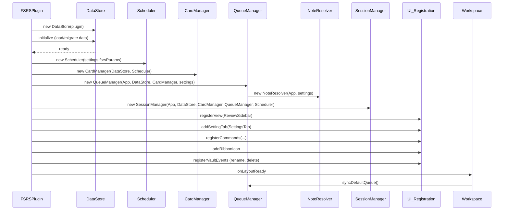

# Plugin Initialization / Lifecycle

onload order and dependencies.

```mermaid
sequenceDiagram
    participant Plugin as FSRSPlugin
    participant DataStore as DataStore
    participant Scheduler as Scheduler
    participant CardManager as CardManager
    participant QueueManager as QueueManager
    participant NoteResolver as NoteResolver
    participant SessionManager as SessionManager
    participant UI as UI_Registration
    participant Workspace as Workspace

    Plugin->>DataStore: new DataStore(plugin)
    Plugin->>DataStore: initialize (load/migrate data)
    DataStore-->>Plugin: ready

    Plugin->>Scheduler: new Scheduler(settings.fsrsParams)
    Plugin->>CardManager: new CardManager(DataStore, Scheduler)
    Plugin->>QueueManager: new QueueManager(App, DataStore, CardManager, settings)
    QueueManager->>NoteResolver: new NoteResolver(App, settings)
    Plugin->>SessionManager: new SessionManager(App, DataStore, CardManager, QueueManager, Scheduler)

    Plugin->>UI: registerView(ReviewSidebar)
    Plugin->>UI: addSettingTab(SettingsTab)
    Plugin->>UI: registerCommands(...)
    Plugin->>UI: addRibbonIcon
    Plugin->>UI: registerVaultEvents (rename, delete)

    Plugin->>Workspace: onLayoutReady
    Workspace->>QueueManager: syncDefaultQueue()
```
