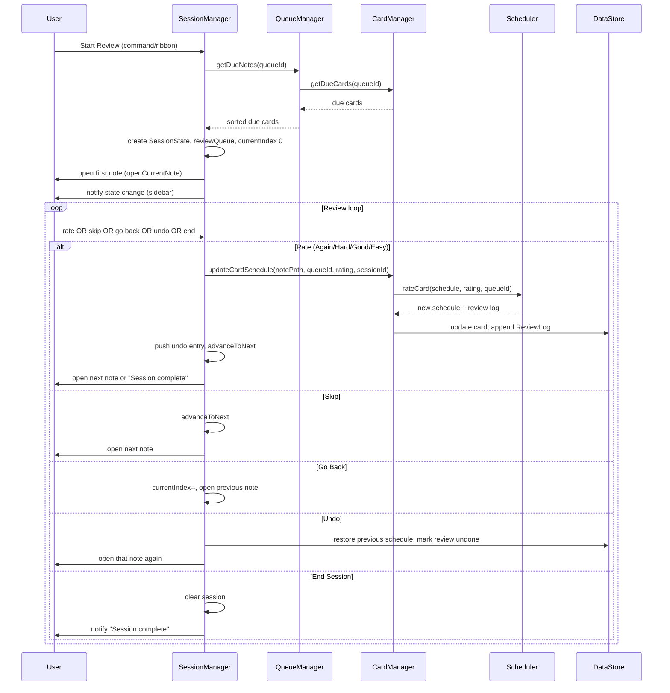
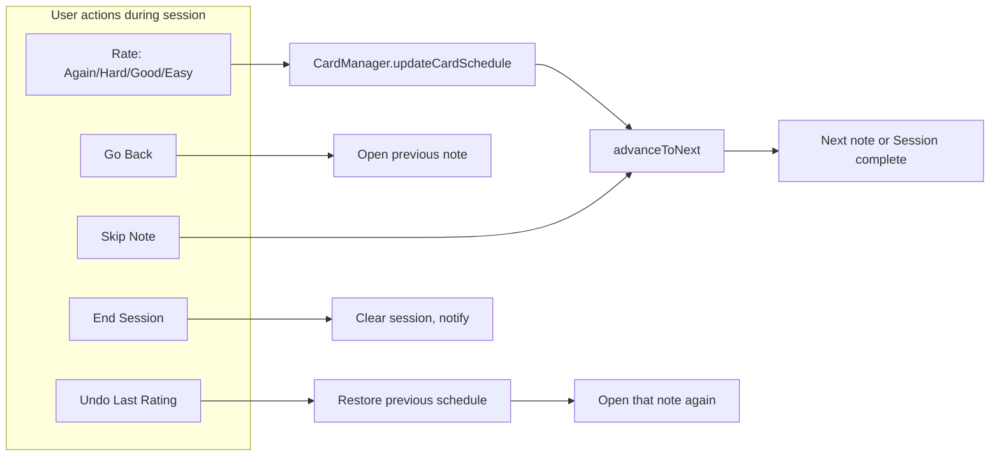

# Review Session Flow

From Start Review to next note or session complete.

## Sequence: Start session and review loop

```mermaid
sequenceDiagram
    participant User
    participant SessionManager as SessionManager
    participant QueueManager as QueueManager
    participant CardManager as CardManager
    participant Scheduler as Scheduler
    participant DataStore as DataStore

    User->>SessionManager: Start Review (command/ribbon)
    SessionManager->>QueueManager: getDueNotes(queueId)
    QueueManager->>CardManager: getDueCards(queueId)
    CardManager-->>QueueManager: due cards
    QueueManager-->>SessionManager: sorted due cards
    SessionManager->>SessionManager: create SessionState, reviewQueue, currentIndex 0
    SessionManager->>User: open first note (openCurrentNote)
    SessionManager->>User: notify state change (sidebar)

    loop Review loop
        User->>SessionManager: rate OR skip OR go back OR undo OR end
        alt Rate (Again/Hard/Good/Easy)
            SessionManager->>CardManager: updateCardSchedule(notePath, queueId, rating, sessionId)
            CardManager->>Scheduler: rateCard(schedule, rating, queueId)
            Scheduler-->>CardManager: new schedule + review log
            CardManager->>DataStore: update card, append ReviewLog
            SessionManager->>SessionManager: push undo entry, advanceToNext
            SessionManager->>User: open next note or "Session complete"
        else Skip
            SessionManager->>SessionManager: advanceToNext
            SessionManager->>User: open next note
        else Go Back
            SessionManager->>SessionManager: currentIndex--, open previous note
        else Undo
            SessionManager->>DataStore: restore previous schedule, mark review undone
            SessionManager->>User: open that note again
        else End Session
            SessionManager->>SessionManager: clear session
            SessionManager->>User: notify "Session complete"
        end
    end
```

## Flowchart: Review actions

```mermaid
flowchart LR
    subgraph actions [User actions during session]
        Rate[Rate: Again/Hard/Good/Easy]
        Skip[Skip Note]
        GoBack[Go Back]
        Undo[Undo Last Rating]
        End[End Session]
    end

    Rate --> UpdateCard[CardManager.updateCardSchedule]
    UpdateCard --> AdvanceNext[advanceToNext]
    AdvanceNext --> NextOrDone[Next note or Session complete]

    Skip --> AdvanceNext

    GoBack --> OpenPrev[Open previous note]

    Undo --> RestoreSchedule[Restore previous schedule]
    RestoreSchedule --> OpenRated[Open that note again]

    End --> ClearSession[Clear session, notify]
```
