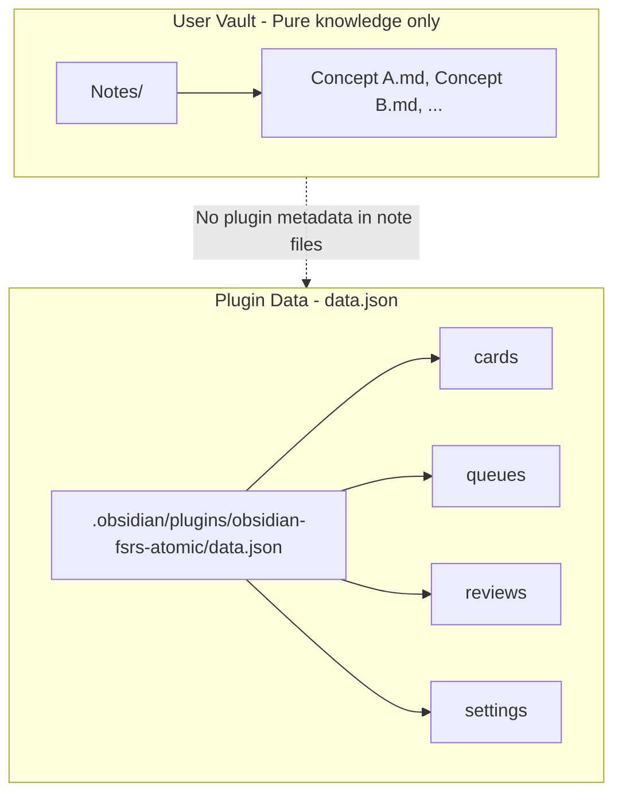

# Storage / Separation of Concerns

Zero note pollution: notes vs plugin data (PRD principle).

```mermaid
flowchart TB
    subgraph vault [User Vault - Pure knowledge only]
        NotesDir[Notes/]
        NoteFiles[Concept A.md, Concept B.md, ...]
        NotesDir --> NoteFiles
    end

    subgraph pluginData [Plugin Data - data.json]
        Path[".obsidian/plugins/obsidian-fsrs-atomic/data.json"]
        Cards[cards]
        Queues[queues]
        Reviews[reviews]
        Settings[settings]
        Path --> Cards
        Path --> Queues
        Path --> Reviews
        Path --> Settings
    end

    vault -.->|"No plugin metadata in note files"| pluginData
```
