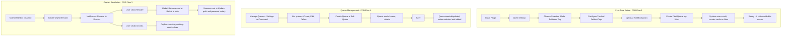

# User Flows

First-time setup, Queue management, and Orphan resolution (PRD Flow 1, 4, 3).

```mermaid
flowchart TB
    subgraph setup [First-Time Setup - PRD Flow 1]
        Install[Install Plugin]
        OpenSettings[Open Settings]
        ChooseMode[Choose Selection Mode: Folder or Tag]
        Configure[Configure Tracked Folders/Tags]
        OptionalExcl[Optional: Add Exclusions]
        CreateQueue[Create First Queue e.g. Main]
        Scan[System scans vault, creates cards as New]
        Ready[Ready - X notes added to queue]
        Install --> OpenSettings --> ChooseMode --> Configure --> OptionalExcl --> CreateQueue --> Scan --> Ready
    end

    subgraph queues [Queue Management - PRD Flow 4]
        ManageQueues[Manage Queues - Settings or Command]
        ListQueues[List queues: Create, Edit, Delete]
        CreateOrEdit[Create Queue or Edit Queue]
        QueueModal[Queue modal: name, criteria]
        Save[Save]
        Created[Queue created/updated, notes matched and added]
        ManageQueues --> ListQueues
        ListQueues --> CreateOrEdit
        CreateOrEdit --> QueueModal --> Save --> Created
    end

    subgraph orphans [Orphan Resolution - PRD Flow 3]
        NoteDeleted[Note deleted or renamed]
        OrphanRecord[Create OrphanRecord]
        Notify[Notify user: Resolve or Dismiss]
        Resolve[User clicks Resolve]
        Dismiss[User clicks Dismiss]
        Modal[Modal: Remove card or Relink to note]
        RemoveOrRelink[Remove card or Update path and preserve history]
        Pending[Orphan remains pending - resolve later]
        NoteDeleted --> OrphanRecord --> Notify
        Notify --> Resolve
        Notify --> Dismiss
        Resolve --> Modal --> RemoveOrRelink
        Dismiss --> Pending
    end
```
